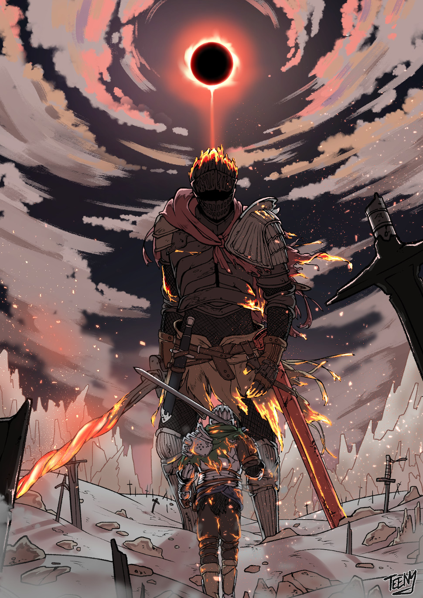

# Exercise Sheet 10 — Kiln of the First Flame

*due on 28 January 2020*

## Side Project

Prepare your side project in such a way that you can show it off in the lab.
It doesn't have to be complete yet.

The final deadline for the side project is 7 February 2020.
Let me know if you require time.

Submit the code via mail using the following subject / link:

    703807 - Side Project Final Submission

📧 [send email](mailto:alexander.hirsch@uibk.ac.at?subject=703807%20-%20Side%20Project%20Final%20Submission)

## Ultimate Task (no points to score)

Study for the final exam.

- - -

> Soul of Cinder is an amalgamation of previous Lords of Cinder, including the Chosen Undead and the Bearer of the Curse, Lord Gwyn, Solaire of Astora, and every other character who has ever linked the First Flame.
> He wields the combined abilities, weapons, and magic of his components, giving him tremendous power.
>
> The Soul of Cinder's role as the deific manifestation of the previous Lords of Cinder is to defend the flame; as such, he acts as the final line of defense against the Ashen One when they arrive at the resting place of the First Flame.
